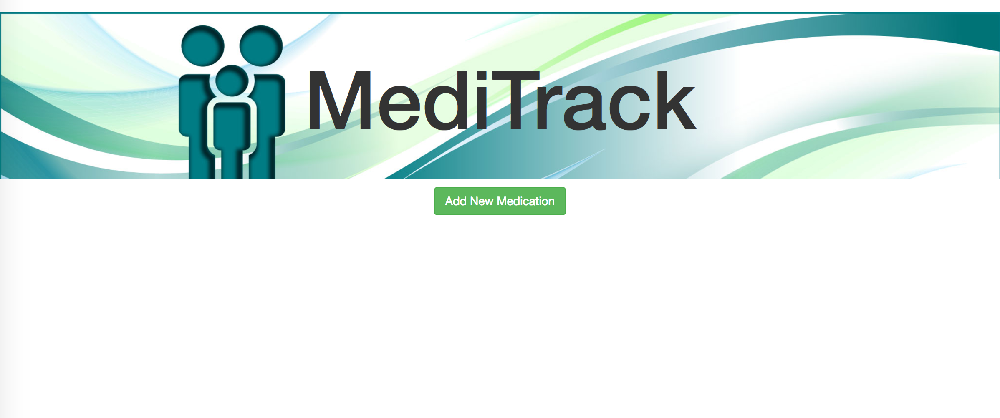
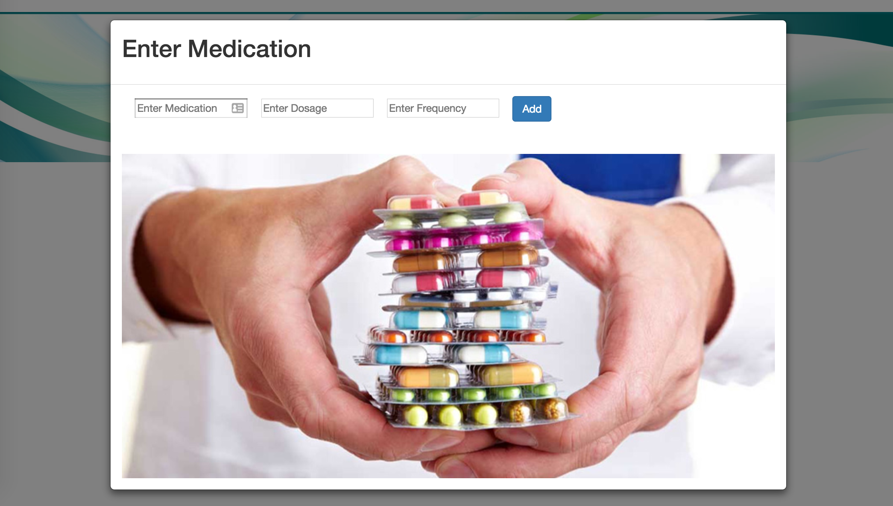
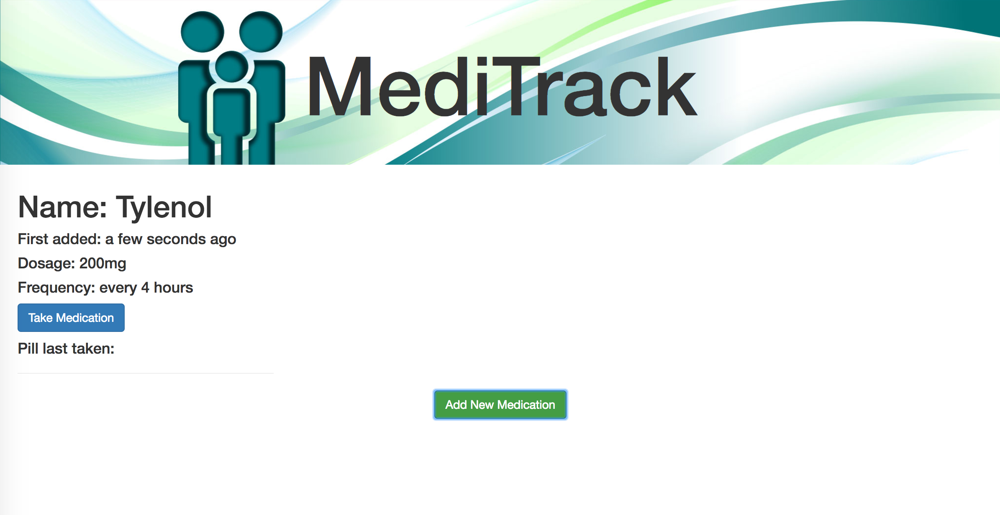
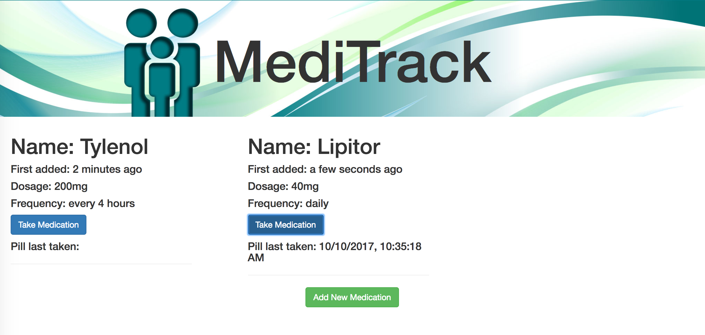

# Medicine Cabinet

_React.js project for Epicodus, 09/15/2017_

By _Larry Taylor_

## Description
This web application was created to allow a user to keep track of their medications. They will be able to add new medicines and be told when they last took those medications.

## Installation

* In your terminal, clone the project directory and install the necessary depencendies with the following commands:
  * `git clone https://github.com/larryjtaylor/React-Medicine-Cabinet.git`
  * `cd React-Medicine-Cabinet`
  * `npm install`
  * `npm start`
* In your browser, navigate to `localhost:8080` to see the project displayed.

##  Program Preview

_Home Page_

_Users enter required medications and instructions for use via a form modal._

_Users can see a list of their inputted medications displayed._

_Users can mark a medication as taken using the 'take medication' button._

## Technologies Used

React.js, JSX, Babel, Bootstrap, Node.js, Webpack, Moment.js, CSS, HTML

## License

Copyright &copy; 2017 Larry Taylor

This software is licensed under the MIT license.
